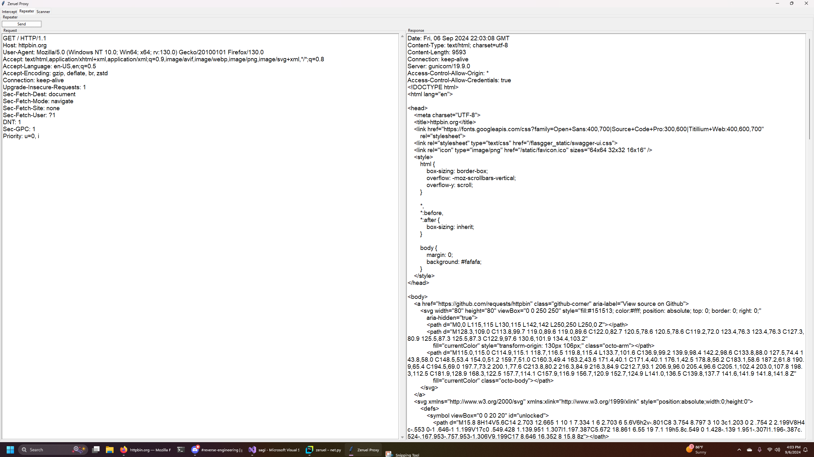
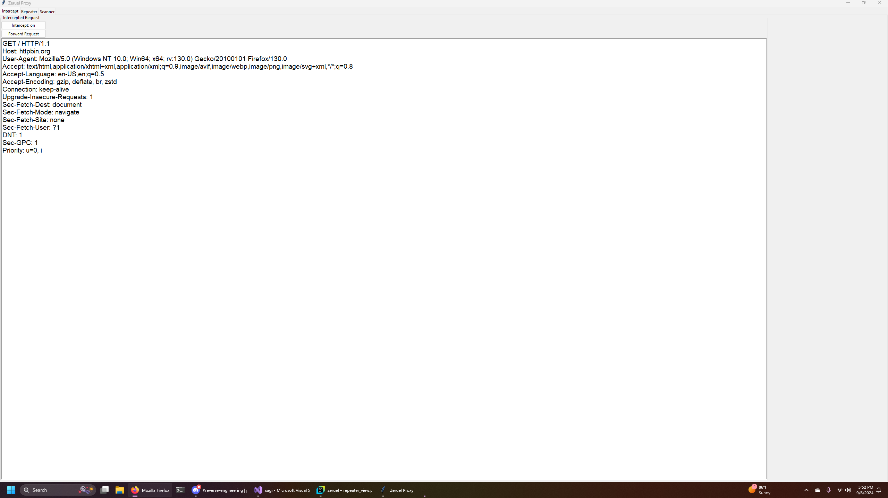
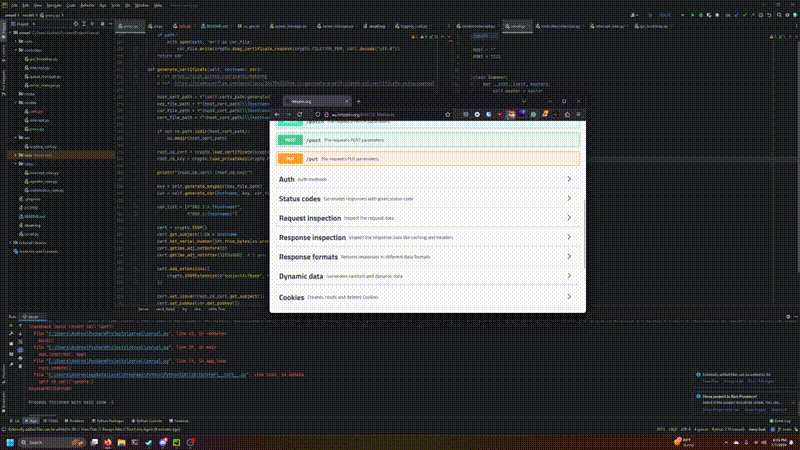

# Zeruel Proxy

A small MITM proxy tool with a GUI

## Usage
### Configure proxy
- If using Firefox as your browser
  1. Open the hamburger menu at the top right of Firefox
  2. Go to Settings
  3. Scroll down to `Network Settings` and open it
  4. Select `Manual Proxy configuration`
  5. set proxy to `127.0.0.1` and port to `7121`
  6. Optionally you can click the checkbox to use it for HTTPS as well (you will need to install the CA cert generated in the section below)

### Setting up HTTPS
1. Run `certs/ca_gen.sh` to generate the CA certificate to be installed
- If using Firefox as your browser
  1. In the navigation bar on the left click on `Privacy & Security`
  2. Scroll down to the `Security/Certificates` section
  3. Click on `View Certificates`
  4. Under the `Authorities` tab click on `Import`
  5. Select the certificate file generated by `certs/ca_gen.sh`, path should be `certs/zeruelCA.crt`
  

## Features

- HTTP/HTTPS request intercept
- HTTP/HTTPS request modification on-the-fly
- Multithreaded sockets
- Dynamic SSL certificate generation 

### On the works
- Request logging and replay

### Might implement
- Directory and file discovery
- Match and replace in requests

## Demo

